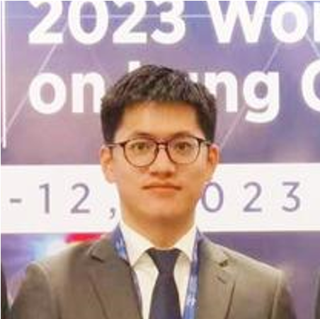
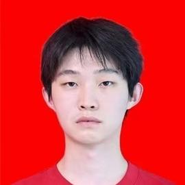
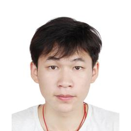

---
title: People
date: 2024-07-03
type: landing
sections:
  - block: markdown
    content:
      title: The Team
      text: |
        <link rel="stylesheet" href="https://cdnjs.cloudflare.com/ajax/libs/font-awesome/5.15.3/css/all.min.css">
        
        

        

          
        

        ---

        ## Principle Investigator

        

          

            
            
<a href="/people/Xu/">Shidang Xu 许适当</a>

            
Professor in Biomedical Engineering

            

              <i class="fas fa-envelope"></i>xusd@scut.edu.cn
            

            

              <i class="fas fa-graduation-cap"></i>Google Scholar
            

          

        

        ---

        ## Graduate Students

        

          

            
            
<a href="/people/Bin/">Bin Xu 许膑</a>

            
23 PhD Student in Biomedical Engineering

            

              <i class="fas fa-envelope"></i>bun_hui@126.com
            

            

              <i class="fas fa-graduation-cap"></i>Google Scholar
            

          

          

            
            
<a href="/people/NB/">Bo Niu 牛博</a>

            
24 Master’s Student in Pharmacy

            

              <i class="fas fa-envelope"></i>niubo7645@gmail.com
            

          

          

            
            
<a href="/people/CC/">Chenchen Li 李晨晨</a>

            
23 PhD Student in Biomedical Engineering

            

              <i class="fas fa-envelope"></i>lcc1430880822@163.com
            

            

              <i class="fas fa-graduation-cap"></i>Google Scholar
            

          

          

            
            
<a href="/people/GF/">Guifang Zhen 甄桂芳</a>

            
25 Master’s Student in Pharmacy

            

              <i class="fas fa-envelope"></i>19866809606@163.com
            

          

          

            
            
<a href="/people/JD/">Jinda Yan 闫缙达</a>

            
24 PhD Student in Materials and Chemical Engineering

            

              <i class="fas fa-envelope"></i>jdyan09@163.com
            

          

          

            
            
<a href="/people/JC/">Jingcheng Mo 莫景丞</a>

            
24 Master’s Student in Pharmacy

            

              <i class="fas fa-envelope"></i>jingchengmo@foxmail.com
            

          

          

            
            
<a href="/people/OY/">Junchi Ouyang 欧阳骏驰</a>

            
24 Master’s Student in Biomedical Engineering

            

              <i class="fas fa-envelope"></i>oyjc_scut@126.com
            

          

          

            
            
<a href="/people/LP/">Lipeng Luo 罗丽鹏</a>

            
24 Master’s Student in Biomedical Engineering

            

              <i class="fas fa-envelope"></i>llp_scut@126.com
            

          

          

            
            
<a href="/people/MT/">Meitang Peng 彭美堂</a>

            
23 Master’s Student in Biomedical Engineering

            

              <i class="fas fa-envelope"></i>meitangpeng@gmail.com
            

          

          

            
            
<a href="/people/GMT/">Mengting Guan 管梦婷</a>

            
24 Master’s Student in Pharmacy

            

              <i class="fas fa-envelope"></i>gmt1923@163.com
            

          

          

            
            
<a href="/people/SC/">Shicheng Lang 稂世成</a>

            
24 PhD Student in Biomedical Engineering

            

              <i class="fas fa-envelope"></i>920815351@qq.com
            

          

          

            
            
<a href="/people/YF/">Yifei Han 韩逸飞</a>

            
25 Master's Student in Biomedical Engineering

            

              <i class="fas fa-envelope"></i>2784331517@qq.com
            

          

          

            
            
<a href="/people/YH/">Yinghao Liu 刘英豪</a>

            
23 Master’s Student in Chemistry

            

              <i class="fas fa-envelope"></i>Yinghao612@gmail.com
            

          

          

            
            
<a href="/people/YJ/">Yujian Liu 刘宇健</a>

            
23 Master’s Student in Biomedical Engineering

            

              <i class="fas fa-envelope"></i>liuyujian0408@gmail.com
            

          

        

        ---

        ## Undergraduate Students

        <table style="width:100%; border-collapse: collapse; border: none;">
          <tr>
            <td style="width: 20%; padding: 8px; vertical-align: middle;">Ruoqi Chen</td>
            <td style="width: 35%; padding: 8px; vertical-align: middle;">Biomedical Engineering at SCUT (2021)</td>
            <td style="width: 45%; padding: 8px; vertical-align: middle;"></td>
          </tr>
          <tr>
            <td style="width: 20%; padding: 8px; vertical-align: middle;">Xinjie Shen</td>
            <td style="width: 35%; padding: 8px; vertical-align: middle;">Artificial Intelligence at SCUT (2021)</td>
            <td style="width: 45%; padding: 8px; vertical-align: middle;"></td>
          </tr>
          <tr>
            <td style="width: 20%; padding: 8px; vertical-align: middle;">Qingquan Wang</td>
            <td style="width: 35%; padding: 8px; vertical-align: middle;">Biomedical Engineering at SCUT (2022)</td>
            <td style="width: 45%; padding: 8px; vertical-align: middle;"></td>
          </tr>
          <tr>
            <td style="width: 20%; padding: 8px; vertical-align: middle;">Yutong Wang</td>
            <td style="width: 35%; padding: 8px; vertical-align: middle;">Biomedical Engineering at SCUT (2022)</td>
            <td style="width: 45%; padding: 8px; vertical-align: middle;"></td>
          </tr>
          <tr>
            <td style="width: 20%; padding: 8px; vertical-align: middle;">Yuechuan Lin</td>
            <td style="width: 35%; padding: 8px; vertical-align: middle;">Biomedical Engineering at SCUT (2023)</td>
            <td style="width: 45%; padding: 8px; vertical-align: middle;"></td>
          </tr>
        </table>

        ---

        ## Alumni

        <table style="width:100%; border-collapse: collapse; border: none;">
          <tr>
            <td style="width: 20%; padding: 8px; vertical-align: middle;">Lu Qiu</td>
            <td style="width: 35%; padding: 8px; vertical-align: middle;">Biomedical Engineering at SCUT (2019-2023)</td>
            <td style="width: 45%; padding: 8px; vertical-align: middle;">Master of Biostatistics, Columbia University (2023)</td>
          </tr>
          <tr>
            <td style="width: 20%; padding: 8px; vertical-align: middle;">Yunlong Zhu</td>
            <td style="width: 35%; padding: 8px; vertical-align: middle;">Biomedical Engineering at SCUT (2019-2023)</td>
            <td style="width: 45%; padding: 8px; vertical-align: middle;">Master of science and engineering, Johns Hopkins University (2023)</td>
          </tr>
          <tr>
            <td style="width: 20%; padding: 8px; vertical-align: middle;">Ying Chen</td>
            <td style="width: 35%; padding: 8px; vertical-align: middle;">Biomedical Engineering at SCUT (2019-2023)</td>
            <td style="width: 45%; padding: 8px; vertical-align: middle;">Master of Biomedical engineering, University of Electronic Science and Technology of China (2023)</td>
          </tr>
          <tr>
            <td style="width: 20%; padding: 8px; vertical-align: middle;">Ranxuan Zhang</td>
            <td style="width: 35%; padding: 8px; vertical-align: middle;">Biomedical Engineering at SCUT (2019-2023)</td>
            <td style="width: 45%; padding: 8px; vertical-align: middle;">Master of Biomedical engineering, Chalmers University of Technology (2023)</td>
          </tr>
          <tr>
            <td style="width: 20%; padding: 8px; vertical-align: middle;">Yuan Chen</td>
            <td style="width: 35%; padding: 8px; vertical-align: middle;">Biomedical Engineering at SCUT (2020-2024)</td>
            <td style="width: 45%; padding: 8px; vertical-align: middle;">PhD in Chemistry, Nanyang Technological University (2024)</td>
          </tr>
          <tr>
            <td style="width: 20%; padding: 8px; vertical-align: middle;">Fangxi Lian</td>
            <td style="width: 35%; padding: 8px; vertical-align: middle;">Biomedical Engineering at SCUT (2020-2024)</td>
            <td style="width: 45%; padding: 8px; vertical-align: middle;">Working at Lubangdi International Logistics Service Co.Ltd (2024)</td>
          </tr>
          <tr>
            <td style="width: 20%; padding: 8px; vertical-align: middle;">Zihuang Lu</td>
            <td style="width: 35%; padding: 8px; vertical-align: middle;">Biomedical Engineering at SCUT (2020-2024)</td>
            <td style="width: 45%; padding: 8px; vertical-align: middle;">Master of Bioinformatics, University of Science and Technology of China (2024)</td>
          </tr>
          <tr>
            <td style="width: 20%; padding: 8px; vertical-align: middle;">Ruoxuan Wu</td>
            <td style="width: 35%; padding: 8px; vertical-align: middle;">Biomedical Engineering at SCUT (2020-2024)</td>
            <td style="width: 45%; padding: 8px; vertical-align: middle;">PhD in Biomedical engineering, University of Texas, Southwestern Medical Center at Dallas (2024)</td>
          </tr>
          <tr>
            <td style="width: 20%; padding: 8px; vertical-align: middle;">Mingyu Lin</td>
            <td style="width: 35%; padding: 8px; vertical-align: middle;">Biomedical Engineering at SCUT (2020-2024)</td>
            <td style="width: 45%; padding: 8px; vertical-align: middle;">Master in Biomedical Engineering, National University of Singapore (2024)</td>
          </tr>
        </table>

        ---
        

          
        
 
---